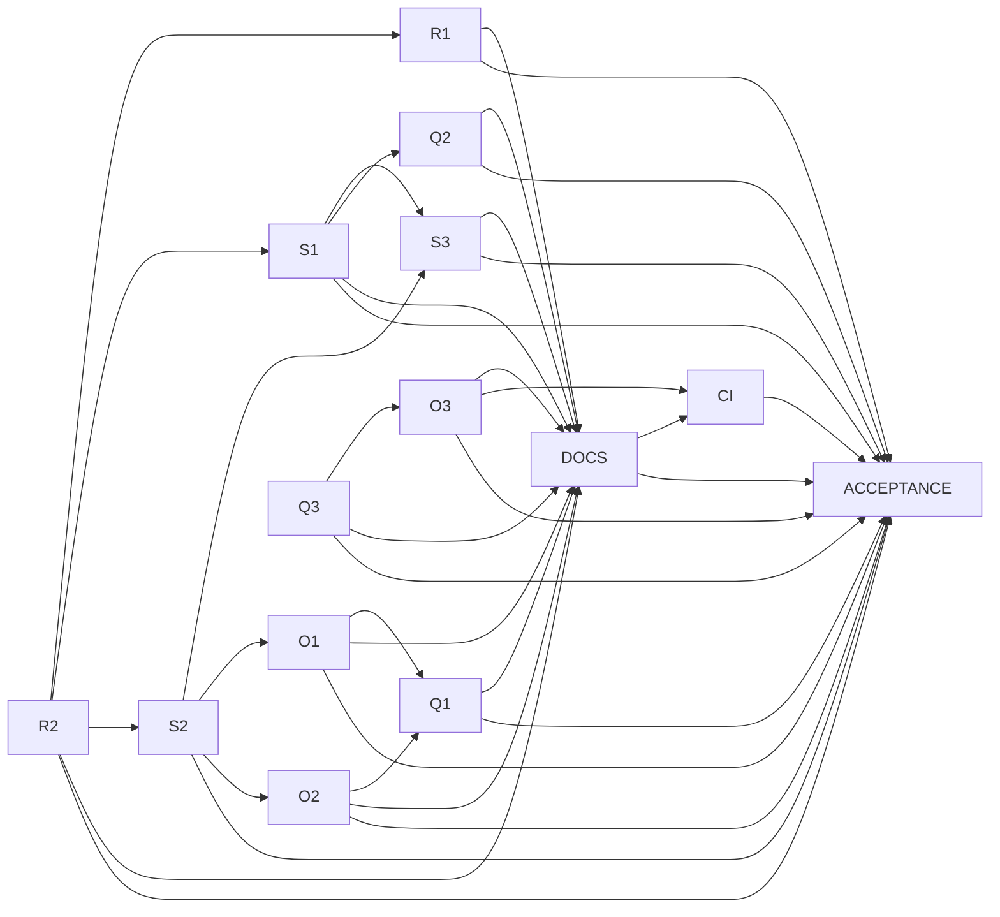

# Canonical package dependency graph

```mermaid
graph LR
  R2 --> R1
  R2 --> S1
  R2 --> S2
  S1 --> S3
  S2 --> S3
  S2 --> O1
  S2 --> O2
  Q3 --> O3
  O1 --> Q1
  O2 --> Q1
  S1 --> Q2
  R1 --> DOCS
  R2 --> DOCS
  S1 --> DOCS
  S3 --> DOCS
  O1 --> DOCS
  O2 --> DOCS
  O3 --> DOCS
  Q1 --> DOCS
  Q2 --> DOCS
  Q3 --> DOCS
  O3 --> CI
  DOCS --> CI
  R1 --> ACCEPTANCE
  R2 --> ACCEPTANCE
  S1 --> ACCEPTANCE
  S2 --> ACCEPTANCE
  S3 --> ACCEPTANCE
  O1 --> ACCEPTANCE
  O2 --> ACCEPTANCE
  O3 --> ACCEPTANCE
  Q1 --> ACCEPTANCE
  Q2 --> ACCEPTANCE
  Q3 --> ACCEPTANCE
  DOCS --> ACCEPTANCE
  CI --> ACCEPTANCE
```

Immediate source frontier: `R2`, `Q3`, `DECISIONS`. External acceptance is separately gated.
